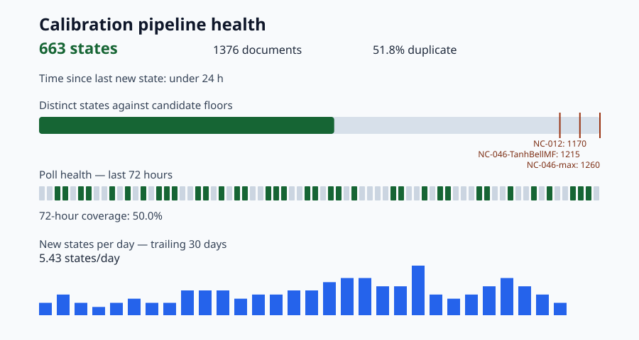

# `calibration-data`

Hourly IBM Quantum calibration snapshots for
[SuperconducTED/superconducted-noise-engine](https://github.com/SuperconducTED/superconducted-noise-engine),
polled by GitHub Actions.

**This is a data branch. It shares no history with `main` and is never merged
into it.** Nothing here is source code; everything is either fetched from IBM or
derived from what was fetched.



The graphic is regenerated daily and committed only when its bytes change, so a
quiet archive produces no commit at all. It carries no clock reading by design:
every figure in it is a function of the committed index and ledger. The exact
timestamps live in [`health/metrics.json`](health/metrics.json).

## Read the number, not the file count

**The unit is the distinct device state, not the file.** Those are not the same
thing and the gap is large: at the time of writing the archive holds 994
documents carrying 563 distinct states, so roughly 43% of what is stored repeats
a calibration we already had.

Counting files is the instrument that misled this project for three months. A
document is one JSON file, named by IBM's `last_update_date`. A device state is
a distinct canonical digest of `properties.qubits` alone, with each parameter's
own `date` normalised away, so a re-measurement that reproduced an identical
value is one state rather than two. Progress toward a training-data floor counts
the second kind.

## Layout

```
snapshots/YYYY-MM/<backend>/<last_update_date>.json   the archive itself
ledger/YYYY-MM.tsv                                    one row per poll outcome
collisions/                                           payloads that diverged under one stamp
health/state-index.tsv                                one row per archived document
health/metrics.json                                   the live figures
health/progress.svg                                   the graphic above
```

| Tree | Written by | Decision record |
| --- | --- | --- |
| `snapshots/` | Calibration Polling, hourly | ADR-020 |
| `ledger/`, `collisions/` | Calibration Polling, every run including no-ops | ADR-025 |
| `health/` | Calibration Pipeline Health, daily, plus a dispatched backfill | ADR-025 amendment, 2026-09-05 |

`ledger/` records what each poll decided: `new`, `duplicate`,
`duplicate-partial`, `collision` or `collision-unreadable`. It is written on
every run, including runs that filed nothing, which is what makes a gap in the
72-hour strip above mean *the poller did not run* rather than *the device did
not change*.

## What not to do here

- **Do not hand-edit anything under `health/`.** All three files are generated.
  `state-index.tsv` is append-only in the poll path; the one permitted rewrite
  is the dispatched backfill's `--rebuild`, which exists because a historical
  sweep files documents out of chronological order.
- **Do not read `is_new_state` as chronology.** It records what the poller could
  see when it wrote the row. Derive first sightings from `last_update_date`, as
  the metrics engine does.
- **Do not cite `projected_days` or `projected_date`** from `metrics.json`. They
  extrapolate a single seven-day count in a straight line and are not
  registrable claims.
- **Do not rewrite history on this branch.** Documents in `docs/` on `main` pin
  figures to commits here; a force-push silently invalidates them.

## Provenance

Every number rendered above appears in `health/metrics.json`, which derives only
from files committed on this branch. Figures quoted in the main repository trace
to a row in
[`docs/numerical-claims.md`](https://github.com/SuperconducTED/superconducted-noise-engine/blob/main/docs/numerical-claims.md);
NC-025 and NC-047 are the ones about this archive. A number on this branch that
you cannot trace to a committed file is a bug, so please report it.

Design and acceptance criteria for the health pipeline are in issue #48, and the
implementation write-up is
[`docs/implementations/2026-09-05-pipeline-health-dashboard.md`](https://github.com/SuperconducTED/superconducted-noise-engine/blob/main/docs/implementations/2026-09-05-pipeline-health-dashboard.md).
